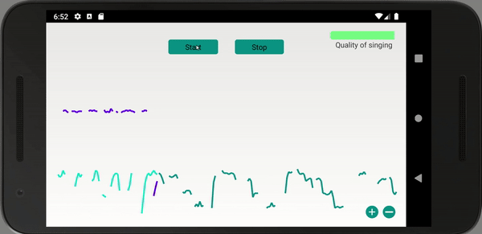
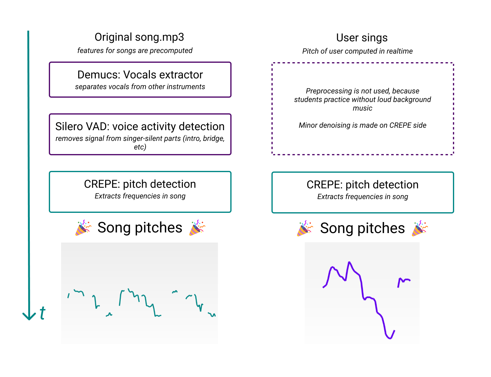

# ShaBoom app

### Table of contents:

1. About project
2. Demonstration
3. ML Pipeline
4. Technologies

## About project

This is the proof-of-concept realization of the ShaBoom app. ShaBoom is an assistant for music schools, that helps pupils to practice, and teachers to track students' progress.

Workflow is:

1. Teacher chooses music track for student's home practice
2. ShaBoom backend extracts song's data to compare it with student's singing, saves it
3. The student opens the app and starts practicing.
4. The student sings, the app compares musical notes that he sings with notes of an original singer (e.g. Freddie Mercury if you practice "Don't stop me now";)

## Demonstration

## ML Pipeline

## Technologies

1. Song file features are computed on python server using **Tensorflow** and **Pytorch** models
2. Pitch detection on user's device - Android NDK + Oboe framework + TF-Lite
3. App - Kotlin
4. Backend - FastAPI

Code of backend and research notebooks: [https://github.com/ProtsenkoAI/shaboom-backend](https://github.com/ProtsenkoAI/shaboom-backend)